# Overkill nRF Board

A modular RF communication board designed for the **Overkill system**, built around the **nRF24L01+ radio module** instead of a bare RF IC + Amplifier. This makes the design easier to assemble, debug, and iterate while keeping it fully modular inside the Overkill ecosystem.

---

## Overview

The Overkill nRF Board handles wireless communication for the system using **nRF24L01+ modules**.

It is designed to be:

- Easy to assemble (no RF IC routing complexity)
- Modular (plugs into Overkill ecosystem)
- Hackable (all signals exposed)
- Repairable (no fine-pitch RF ICs)
- Hand-solderable (mostly 0805 components)

### Operating Modes

- **Standalone mode** → acts like a standard nRF24 breakout module
- **Integrated mode** → RF subsystem inside Overkill system

---

## Why

- Most off-the-shelf nRF24 setups are either too barebones or too messy to integrate into real projects. Debugging is hard, power handling is often ignored, and the RF design is usually not optimized for real-world use.
- This board is designed to be a **usable, hackable, and modular RF subsystem** that can be easily integrated into the Overkill system or used standalone for RF experimentation.

---

## Key Changes from Previous Revision

- Removed discrete nRF24 RF IC design
- Switched to **nRF24L01+ module-based design**
- Simplified RF routing significantly
- Improved reliability and build speed
- Reduced RF design complexity

---

## Hardware

### Radio

- nRF24L01+ module (SPI interface)
- Optional PA+LNA module support (with proper power handling)

### Components

- Mostly **0805 footprint components**
  - Easier soldering
  - Better availability
  - More forgiving for hand assembly

### Interface

Connection to Overkill system via **JST-PH connector**:

- 3.3V power
- Data signals

---

## Design Philosophy

This board prioritizes:

- Simplicity over compact size
- Modularity over integration
- Debuggability over RF perfection

The goal is fast iteration for RF experimentation inside the Overkill platform.

---

## Power Notes

- Requires stable **3.3V supply** or **USB power** with proper regulation
- nRF24 modules are 5V tolerant, but the esp32 is not, so 3.3V is used for the logic part of the board
- Add decoupling capacitors close to module
- PA+LNA modules may require higher current bursts during transmission, so ensure power supply can handle it

---

## PCB Design Notes

- Designed around **0805 components**
- Maintain solid ground plane under RF section
- Keep antenna area free of copper and components
- use external antennas if possible for better performance

---

## Images

All pictures and screenshots should be in the `images/` folder.

### PCB Layout

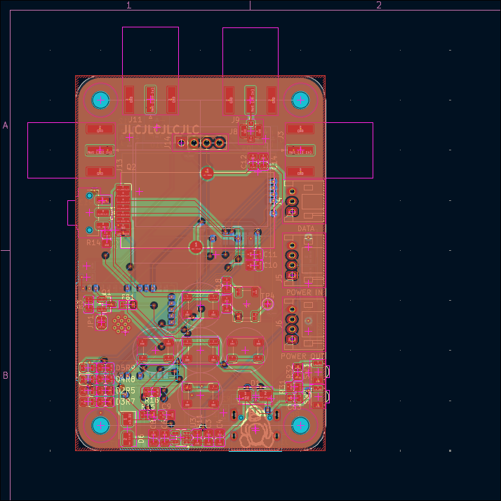

---

### 3D Renders

Top-side render (ray-traced KiCad):
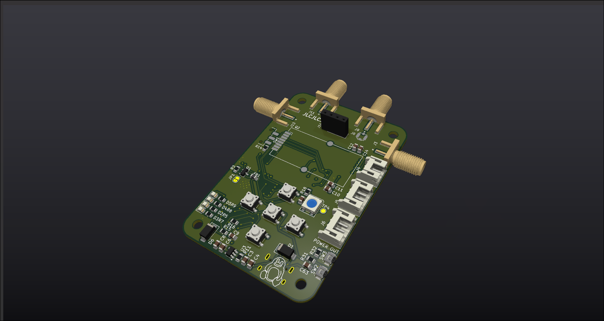

Bottom-side render (ray-traced KiCad):
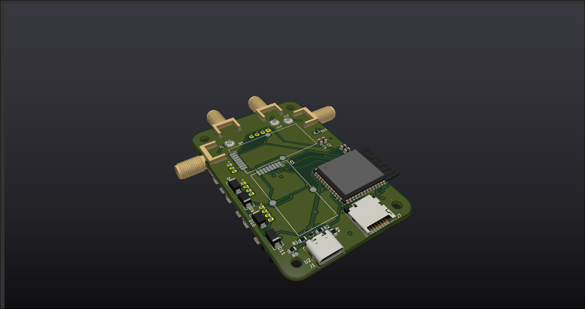

---

### Schematics

schematic sheet 1:
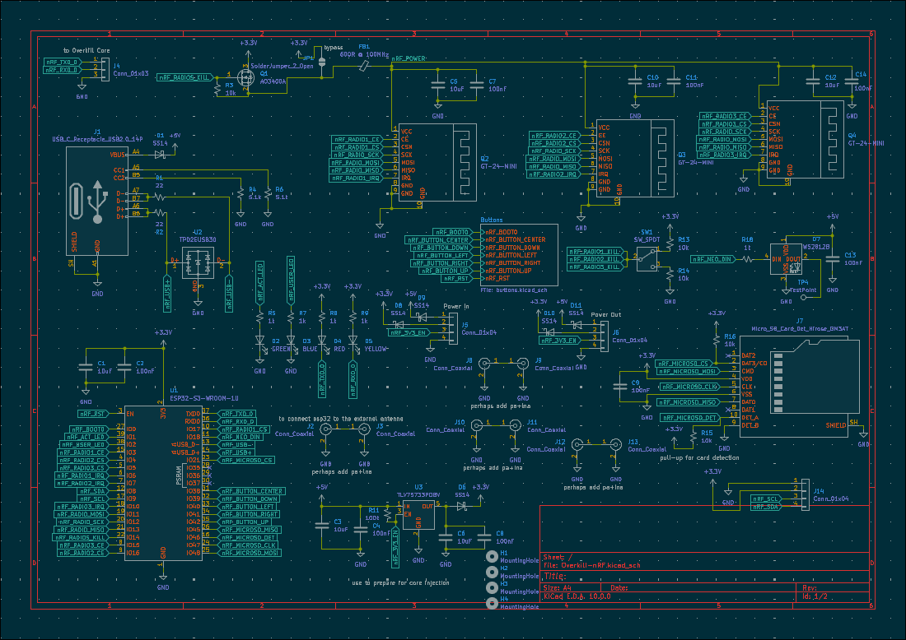

schematic sheet 2:
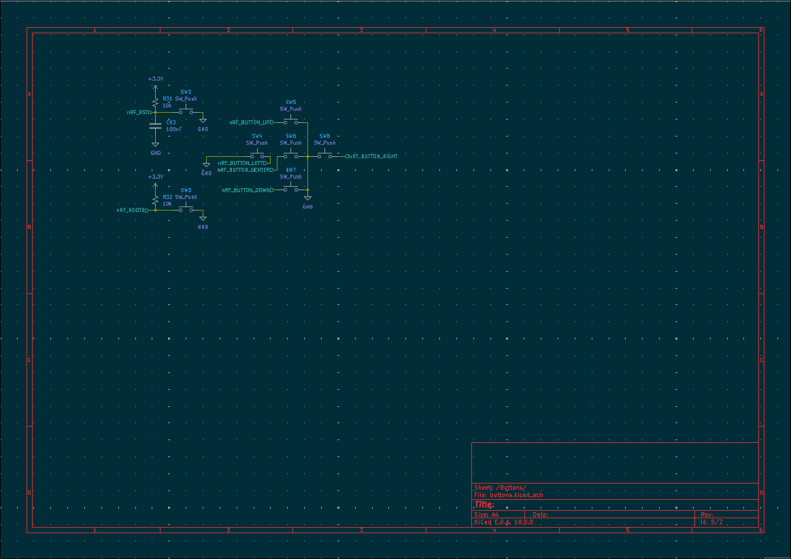

---

### Manufacturing / Sourcing

AliExpress cart:
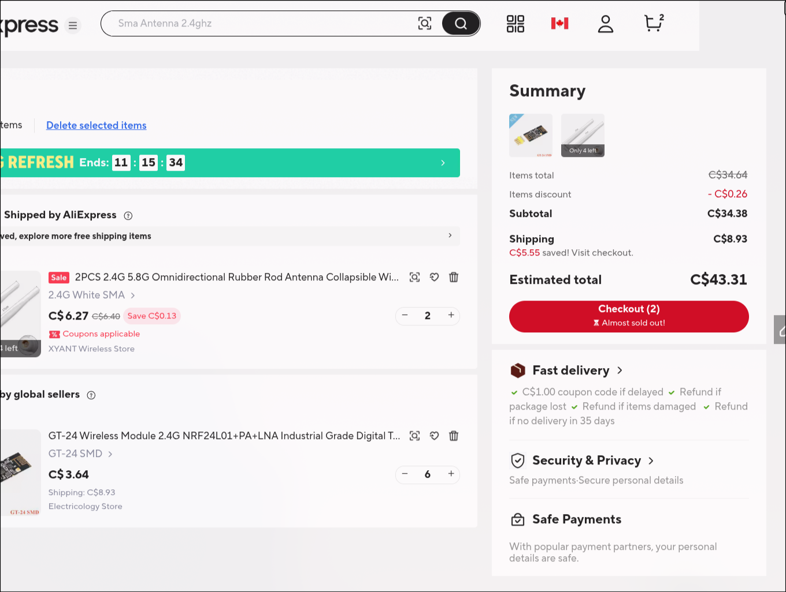

LCSC sourcing carts:
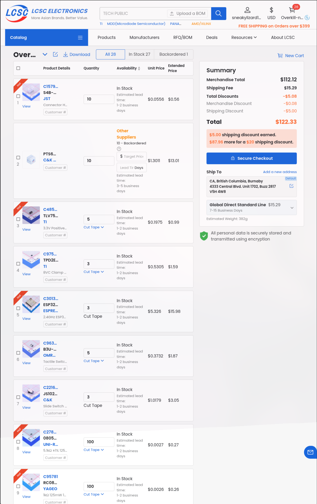
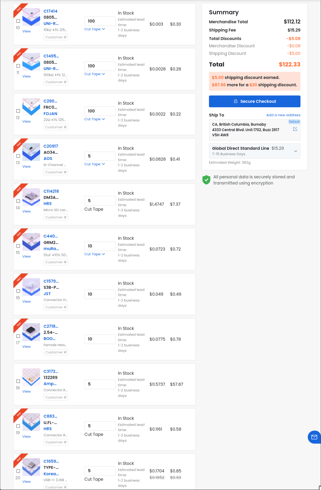
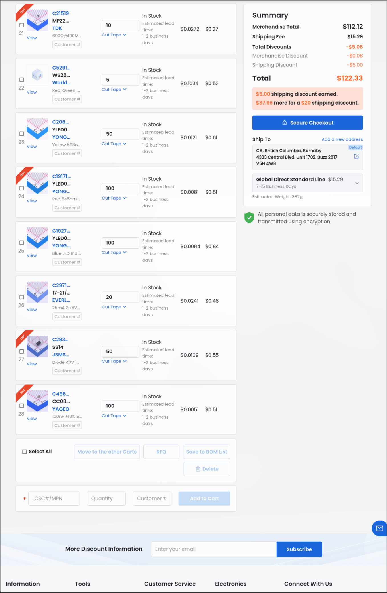

JLCPCB cart:
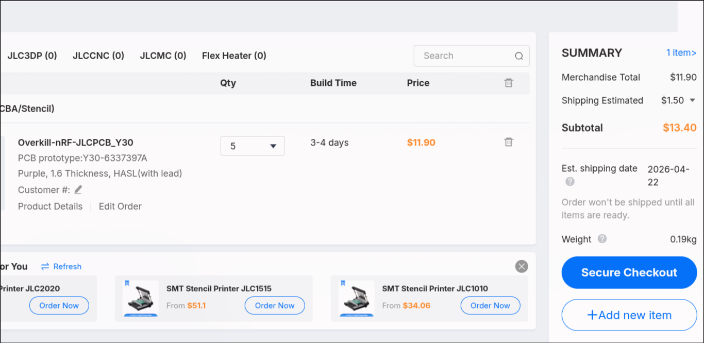
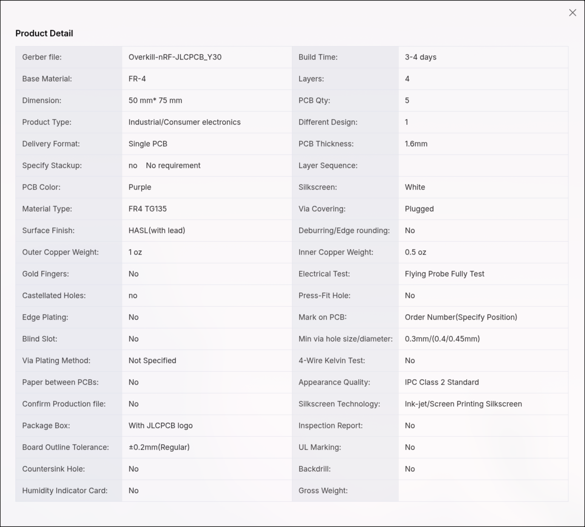
or maybe PCBWay if they sponsor this project too!

---

## System Integration

The board connects into the Overkill system via JST-PH and is designed to interface with:

- Core controller board (SPI master)
- Power distribution board
- Other modular subsystems

Other parts of the system are being developed separately.

---

## Assembly and Programming

1. Start with passives
   - Solder resistors and capacitors first
   - Double-check values and placements
2. Power section
   - Assemble regulator and power filtering stage
   - Verify 3.3V rail before adding ICs
3. MCU and logic components
   - Solder ESP32 and other chips
   - Inspect for shorts between pins
4. nRF24 module
   - Carefully align pins
   - ensure solid ground connection
5. LEDs and indicators
   - Add status LEDs if desired
   - Match polarity correctly
   - Confirm resistor values for current limiting
6. Final inspection
   - Continuity check all power rails
   - Inspect RF sections for solder bridges

---

## How to Use
1. Powering the board
   - Connect USB power or 3.3V supply to the JST-PH connector
   - Ensure power supply can provide sufficient current for nRF24 module, especially if using PA+LNA version
2. Programming the ESP32
   - Use PlatformIO or Arduino IDE to flash firmware
   - Connect to the board via USB or UART for debugging
3. Integrating with Overkill system
   - Connect the board to the core controller via JST-PH
   - Use SPI interface to communicate with the nRF24 module
   - Test RF communication with other nRF24 devices

---

## Bill of Materials (BOM)

A full BOM is included in the repository.
see [bom.csv](bom/bom.csv) for details.

It includes:

- Component references
- Values / part numbers
- Quantities
- LCSC number
- Where to get them (AliExpress, LCSC, etc.)

---

## Repository Structure

- bom/ - Bill of Materials (BOM) files
- blender/ - 3D models and renders
- cad/ - STEP files
- firmware/ - code for project (platformio)
- images/ - pictures and screenshots
- kicad/ - KiCad project files
- zine/ - zine page for hack club

---

## Status

- Breadboard Prototype complete
- PCB routed in KiCad
- 3D assembly done
- Ready for fabrication

---

## Notes

This revision prioritizes usability and fast iteration over RF optimization complexity. The goal is to make RF experimentation inside the Overkill system fast, modular, and actually enjoyable to play with.
